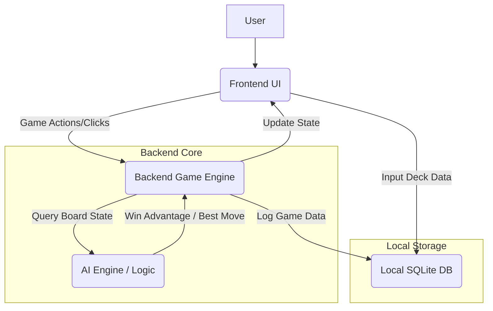

# Technical Specification: TCG Deckhand

**Author(s):** Luke Weigand  
**Date Created:** 10/14/2025  
**Last Updated:** 10/14/2025  
**Related Product Requirements:** Ultimate PRD and PDB

## 1. Introduction and System Overview

The TCG Deckhand MVP is a **downloadable, single-player desktop application** that provides a private, secure, and data-rich environment for competitive Trading Card Game (TCG) players. The core technical goal is to build a **TCG-agnostic game engine** capable of running a full game between a user and a computer opponent.

The primary components being built are:

- **Generic TCG Rule Engine:** Handles all core game logic, card interactions, and rules enforcement
- **AI Algorithm/Engine:** Implements the computer opponent and the core logic for the "Win Advantage" calculator and "Best Move" suggestion feature
- **Local Data Layer (Database/Storage):** Manages user-input deck data and locally stores game session data for privacy

The system is designed as a **standalone desktop application** that does **not** interact with existing external systems (no multiplayer, no external APIs in the MVP). This architecture ensures the platform's core value proposition of **privacy and security**.

### 1.1. Technology Stack

Since the product is defined as a downloadable desktop application focused on a **TCG-agnostic game engine**, the technology stack will prioritize cross-platform desktop application development, performance, and local data management.

| Component Type | Required Tools/Languages/Frameworks | Version | Rationale |
|----------------|-------------------------------------|---------|-----------|
| Primary Language | Python | 3.10+ | Excellent for AI/algorithmic development (for the "Best Move" feature) and a strong ecosystem for game engine logic |
| Desktop Framework | Electron (for a web/js frontend) or Kivy/Tkinter (for a pure python gui) | Latest Stable | Enables cross-platform deployment (Windows, macOS) for the downloadable application requirement |
| AI/Logic Libraries | NumPy, Custom Minimax/Monte Carlo Tree Search implementation | N/A | Essential for the performance-critical, data-intensive "Win Advantage" and "Best Move" algorithms |
| Local Data Storage | SQLite | Latest Stable | Provides a simple, embedded, serverless relational database for local storage of user-inputted card data and game logs, supporting the "data stored locally" requirement |

## 2. Architectural Design

### Component Responsibilities

- **Frontend UI:** Manages the visual display of the game board, handles user input (clicks, form submissions for deck input), and renders the data from the Backend Core, including the "Win Advantage" and "Best Move" suggestions
- **Backend Game Engine (Generic TCG Rule Engine):** Enforces TCG rules, manages the game state (hand, field, deck, discard pile), processes legal moves, and coordinates with the AI Engine
- **AI Engine / Logic (Best Move Algorithm):** Analyzes the current game state, calculates win probability ("Win Advantage"), determines all legal moves, and suggests the move with the highest potential score ("Best Move")
- **Local SQLite DB:** Persists user-inputted, generic card data (names, stats, rules text) and stores game session logs locally for later analysis

## 3. Detailed Component Design

Since the MVP is a local desktop application and **not** a client-server web application, the traditional sections for API Endpoints and Database Schema are adapted to the system's local, file-based interaction and embedded database structure.

### 3.1. API Endpoints

The following defines the critical communication contract between the Frontend UI and the Backend Core logic, which will be implemented via **Internal Process Communication (IPC) calls** or direct **function calls** within the single-process application.

| Endpoint (function) | Method/Context | Data/State Input | Success Response/Return | Rationale |
|---------------------|----------------|------------------|------------------------|-----------|
| Process Deck Input | Function Call (on Save button click) | deckData: JSON object of card names, quantities, and generic rule text | status: "Success" or "Error: [Validation Message]" | Validates and saves the user's custom card data to the local DB |
| Start Game | Function Call (on Start Game button click) | userDeckId: UUID, aiDeckId: UUID | gameState: Initial board state object (hands, deck sizes, board presence) | Initializes the TCG Rule Engine and the game board |
| Submit Move | Function Call (on card drag/drop or button click) | move: JSON object defining the action (e.g., {"type": "play_card", "card_id": "xyz", "target": "field"}) | updatedGameState: Full game state after move processing, isGameOver: Boolean | Core gameplay loop. Updates the board state and triggers AI move if it's the AI's turn |
| Suggest Best Move | Function Call (on 'Suggest Best Move' click) | currentGameState: Full board state object | bestMove: JSON object defining the optimal action, winProbability: Float (0.0 to 1.0) | The primary feature—calls the AI Engine to run its analysis |

### 3.2. Database Schema

The embedded SQLite database will store two primary tables: **Card Definitions** (user-inputted, TCG-agnostic data) and **Game Logs** (for session analysis).

#### Card Definitions

| Column name | Data Type | Constraints | Description |
|-------------|-----------|-------------|-------------|
| id | TEXT(UUID) | PRIMARY KEY, NOT NULL | Unique ID for the user-defined card |
| name | VARCHAR(255) | NOT NULL, UNIQUE | User-defined card name (generic to avoid copyright) |
| type | VARCHAR(50) | NOT NULL | e.g., 'Creature', 'Spell', 'Resource' |
| text | TEXT | NOT NULL | The generic rules text for the card effect |
| stats | JSON/TEXT | NULL | JSON of generic stats (e.g., attack, defense, cost) |

#### Game Sessions

| Column name | Data Type | Constraints | Description |
|-------------|-----------|-------------|-------------|
| session_id | TEXT(UUID) | PRIMARY KEY, NOT NULL | Unique ID for the game session |
| user_deck_id | TEXT(UUID) | FOREIGN KEY references card_definitions.id | The user's deck used in the game |
| ai_deck_id | TEXT(UUID) | FOREIGN KEY references card_definitions.id | The AI's deck used in the game |
| start_time | TIMESTAMP | NOT NULL, DEFAULT CURRENT_TIMESTAMP | Time the game started |
| end_time | TIMESTAMP | NULL | Time the game ended |
| winner | VARCHAR(50) | NULL | 'User', 'AI', or 'Draw' |
| move_log | TEXT(JSON) | NOT NULL | Complete, ordered log of every move and key game state for later analysis |

### 3.3. UI/UX Flow (Technical Perspective)

The technical flow focuses on the **single-player game loop** and the **AI analysis interaction**.

#### User Flow: Game Play and Analysis

1. **Deck Input:** The user fills out a form or imports a generic file with their card names, stats, and rules text. The frontend calls the **Process Deck Input** function, which validates the data and saves it to the local SQLite card_definitions table

2. **Game Start:** The user selects two pre-saved decks (User vs. AI) and clicks **Start Game**. The frontend calls the **Start Game** function, which initializes the TCG Rule Engine and renders the initial gameState

3. **Core Game Loop:** The user performs an action (e.g., dragging a card). The frontend captures the action and calls the **Submit Move** function
   - The Backend Game Engine processes the move, updates the state, and records the move in the game_sessions log
   - If it is the AI's turn, the Engine calls the AI's internal move function, which uses the same logic as Suggest Best Move to select the optimal action

4. **Strategic Analysis:** At any point, the user clicks the "Suggest Best Move" button
   - The frontend calls the **Suggest Best Move** function, passing the currentGameState
   - The AI Engine runs its algorithm (e.g., MCTS) to find the optimal move and calculates the resulting **winProbability**
   - The function returns the bestMove and winProbability. The frontend highlights the suggested move and updates the "Win Advantage" visual element

5. **Game End:** When isGameOver is true, the frontend displays the winner, and the Backend Game Engine finalizes the game_sessions log with the end_time and winner

## 4. Non-Functional Requirements (Technical)

These technical quality attributes are mandatory constraints for the AI agent during implementation.

| Category | Requirement | Description/Metric |
|----------|-------------|-------------------|
| Security | Data Isolation | All player-specific deck lists and game logs **must be stored locally** on the user's machine and never transmitted over a network. This ensures player privacy and confidentiality of strategy |
| Security | Input Sanitization | All user-inputted card data (names, text, stats) must be sanitized and validated before being saved to the SQLite database to prevent any potential local injection attacks |
| Performance | AI Latency (best move) | The **Suggest Best Move** function must return its analysis and suggestion in **under 2.0 seconds** for a standard TCG board state (a measurable time that maintains a smooth user experience) |
| Performance | Core Gameplay Loop | A simple game action (like drawing a card or submitting a move without AI analysis) must process and update the state in **under 100ms** |
| Error Handling & Recovery | Data Corruption | If the local SQLite database file is unreadable or corrupted upon application launch, the system must handle the error gracefully by **reverting to a default, empty state** and prompting the user to re-input their decks, rather than crashing the application |
| Error Handling & Recovery | Fatal Game Logic Error | Any unhandled exception within the Generic TCG Rule Engine that prevents a game from continuing should immediately log the full board state and error trace to a local log file, and display a user-friendly message allowing the user to **restart the application** |

## 5. Further Considerations

### 5.1. Alternative Solutions Considered

| Alternative | Reason for Rejection |
|-------------|---------------------|
| Web-Based Solution (Client-Server) | Rejected because the core value proposition requires **privacy and security**. A local, downloadable application guarantees that a player's strategic data is never exposed on a public server |
| Using a Pre-Existing Open-Source TCG Engine | Rejected because the requirement is for a **TCG-agnostic generic rule engine**. Most open-source engines are tied to a specific game, which would violate the TCG-agnostic goal and the copyright mitigation strategy |
| Statically Pre-Calculating AI Moves | Rejected for the AI engine. The complexity of TCG board states requires a **real-time, deep search algorithm** (like MCTS) to accurately calculate the **"Win Advantage"** based on the current, dynamic board state, which cannot be pre-calculated |

### 5.2. Risks and Mitigation Plan

| Risk | Mitigation Strategy |
|------|-------------------|
| AI Algorithm Performance | The AI's Minimax/MCTS algorithm may be too slow to meet the **2.0-second latency requirement** due to the complexity of the TCG search space |
| Generic Rule Engine Over-Complexity | Creating a truly generic and flexible TCG engine to accommodate future rule sets (as assumed in the PRD) could lead to an overly complex or unstable MVP |
| User Data Input Frustration | The requirement for users to manually input all generic card data could create a poor user experience and discourage adoption |
